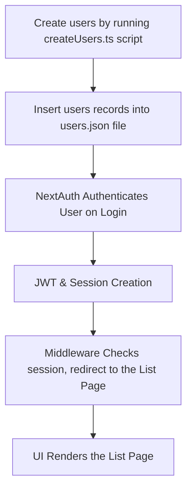
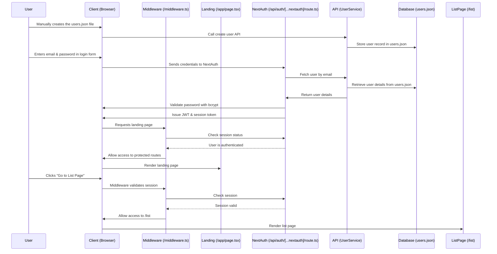

# Process Flow: Next.js Authentication

This document outlines the end-to-end process of how a user is created, authenticated, and verified using your Next.js application.

---
## 1. User Creation and Authentication (NextAuth Integration)

### 1.1 Registration Flow
  You can create users for now by running the script command:
  
  ```powershell
    npx tsx app/utils/createUsers.ts
  ```

### 3.2 Authentication Flow (NextAuth)

- **User Authentication:**  
  - NextAuth is configured with a credentials provider (and optionally with OAuth providers) to authenticate users.
  - The `GetUserByEmail` function fetches the user record from the API.
  - The provided password is verified against the stored hashed password using bcrypt.
    
- **Session & JWT Management:**  
  - On successful authentication, NextAuth stores essential user data (such as the user ID) in the session and JWT token.
  
- **Route Protection:**  
  - Middleware intercepts requests to protected routes (e.g., `/list`) and redirects unverified or unauthenticated users to `/` or for now just displaying UnAuthorized message.

---

## Summary Flow Diagram


## Detailed Process Sequence Diagram

---
## Conclusion

This process flow integrates the following components:

- User Creation & Authentication (NextAuth):
Handles manual creation of users and authenticates users only after logging in.

---

This document provides a comprehensive understanding of how sunvoy web application components interact, from users creation through authentication. 
